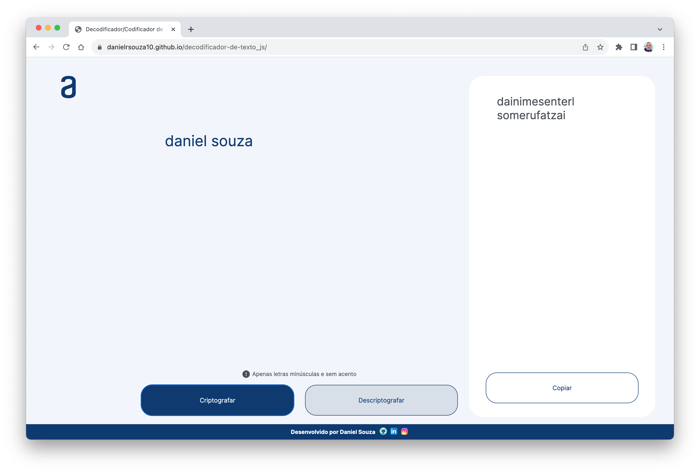
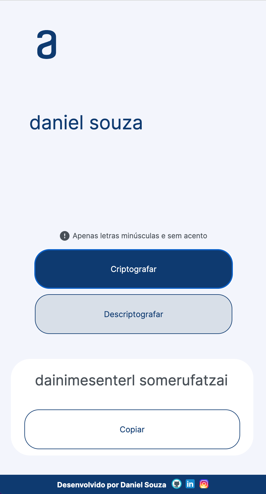

# Text Encoder/Decoder

## Table of contents

- [Overview](#overview)
  - [The challenge](#the-challenge)
  - [Screenshots](#screenshots)
  - [Links](#links)
- [My process](#my-process)
  - [Built with](#built-with)
  - [What I learned](#what-i-learned)
  - [Continued development](#continued-development)
  - [Useful resources](#useful-resources)
- [Author](#author)

## Overview

### The challenge

Users should be able to:

- Type a text and choose to encode or decode it;
- Copy the result text to the clipboard;
- See responsive layouts to diferents sizes of screens;

### Screenshots







### Links

- Solution URL: [GithHub Repository](https://github.com/danielrsouza10/decodificador-de-texto_js)
- Live Site URL: [Decodificdor/Codificador de Texto](https://danielrsouza10.github.io/decodificador-de-texto_js/)

## My process

### Built with

- Semantic HTML5 markup
- CSS custom properties
- Flexbox
- Javascript

### What I learned

Improved the manipulation of the DOM with JavaScript.
Improve functions on JavaScript.
Make clean HTML and CSS.
Responsive Web Design.

```js
function criptografar(input) {
  const inputUsuario = input.value.split("");
  // console.log(inputUsuario);
  let result = "";
  for (let i = 0; i < inputUsuario.length; i++) {
    if (inputUsuario[i] == "a") {
      inputUsuario.splice(i, 1, "ai");
    } else if (inputUsuario[i] == "e") {
      inputUsuario.splice(i, 1, "enter");
    } else if (inputUsuario[i] == "i") {
      inputUsuario.splice(i, 1, "imes");
    } else if (inputUsuario[i] == "o") {
      inputUsuario.splice(i, 1, "omer");
    } else if (inputUsuario[i] == "u") {
      inputUsuario.splice(i, 1, "ufat");
    }
  }
  result = inputUsuario.join("");
  // console.log(result);
  return result;
}
```

```js
function createResultDiv(textoCriptografado) {
  const showTextoCriptografado = document.createElement("div");
  showTextoCriptografado.textContent = textoCriptografado;
  showTextoCriptografado.className = "texto-criptografado";
  while (resultContainer.firstChild) {
    resultContainer.removeChild(resultContainer.firstChild);
  }
  return showTextoCriptografado;
}
```

### Continued development

Add some style when the user copy the text to the clipboard.

### Useful resources

- [Alura](https://www.alura.com.br) - This helped me for DOM Manipulation.

## Author

- Website - [Linkedin](https://www.linkedin.com/in/danielrsouza/)
- Instagram - [@danielrsouza](https://www.instagram.com/danielrsouza)

This is a solution to the [Desafio Challenge ONE Iniciante em Programação](https://www.alura.com.br/challenges/challenge-one-logica?_gl=1*cr056v*_ga*MTg2MDUwNTU3Ny4xNzA5NDEwOTkw*_ga_1EPWSW3PCS*MTcwOTQxMDk5MC4xLjEuMTcwOTQxMTAxMy4wLjAuMA..*_fplc*Z1g2SGlXREdweE9reEFIRkp3SlVQSU04c050RGlUM3l4M0todVhyZXFIQTJkSVg0SkVua1RhNHhqQUpNYUJiajFkeUpYcGs4TVdXZUlvajQycW14WG5FdXcyc011RFJ1WlFWYWZkcDN1NG8lMkJRdVc3Q3Y2TVUwQmhmYUVqeEElM0QlM0Q.).
